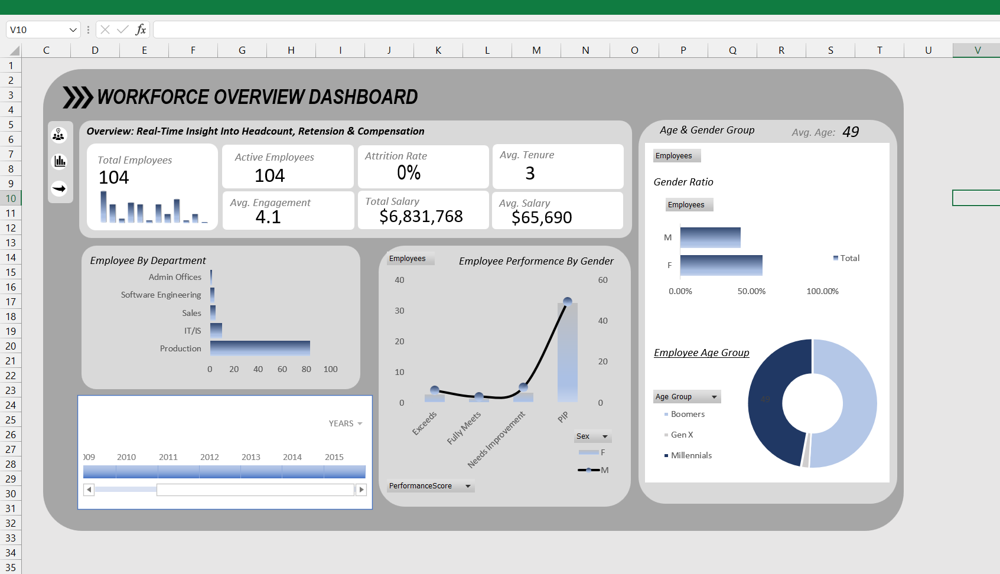

# Workforce Overview Dashboard 📊

An interactive HR Analytics dashboard built in Microsoft Excel using **Power Query, Power Pivot, DAX, Pivot Charts, Slicers, and Timelines**.

This project focuses on transforming raw HR data into meaningful workforce insights and executive-level reporting.

---

# 🚀 Project Overview

This dashboard provides a complete overview of workforce metrics including:

- Employee Headcount
- Attrition Analysis
- Salary Insights
- Employee Engagement
- Department Distribution
- Gender-Based Performance
- Workforce Demographics
- Age Group Segmentation

The project demonstrates how Excel can be used as a Business Intelligence tool for HR analytics.

---

# 🛠️ Tools & Technologies Used

- Microsoft Excel
- Power Query (ETL)
- Power Pivot
- DAX Measures
- Pivot Tables & Pivot Charts
- Slicers & Timelines
- Dashboard UI Design

---

# 📌 Key Features

## ✅ Interactive Dashboard
- Dynamic filtering using slicers and timelines
- Interactive KPI cards
- Responsive charts and visuals

## ✅ Data Modeling
- Built relationships between tables using Power Pivot
- Structured scalable data model for reporting

## ✅ DAX Measures
Used DAX calculations for:
- Attrition Rate
- Average Salary
- Total Salary
- Average Engagement Score
- Employee Count KPIs

## ✅ HR Analytics Insights
- Department-wise workforce distribution
- Gender ratio analysis
- Employee performance comparison
- Age group segmentation
- Workforce demographic trends

---

# 📊 Dashboard KPIs

| KPI | Value |
|------|------|
| Total Employees | 104 |
| Active Employees | 104 |
| Attrition Rate | 0% |
| Average Tenure | 3 Years |
| Average Engagement Score | 4.1 |
| Total Salary | $6.8M+ |
| Average Salary | $65K+ |

---

# 📷 Dashboard Preview



---

# 🧠 What I Learned

This project helped me gain practical experience in:

- Data Cleaning & Transformation
- Building Data Models
- Writing DAX Measures
- Business Intelligence Reporting
- HR Analytics
- Dashboard Storytelling

One of the biggest takeaways was understanding how backend data modeling and DAX calculations power interactive dashboards.


# 📂 Project Structure

```bash
 ┣ 📊 Data Model.png
 ┣ 📊 HR_Analysis.xlsx
 ┣ 📸 HR_analysis.png
 ┣ 📄 README.md
```

# ⭐ If You Like This Project

Feel free to star the repository and share your feedback!
